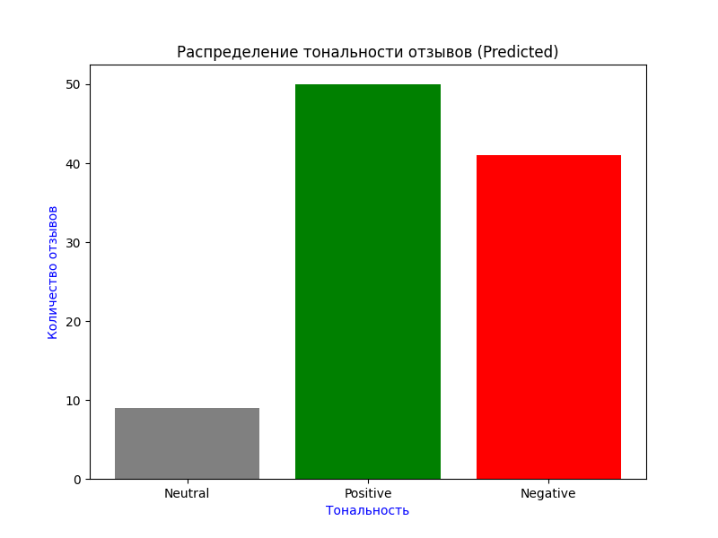

# Sentiment_Analysis_of_Cafe_Reviews ☕️
Проект для автоматического анализа тональности отзывов о кафе с использованием предобученной модели **RuBERT**. Программа классифицирует текст на три категории: нейтральный, положительный и отрицательный, а затем визуализирует результаты.

# Основные возможности 🚀
* **NLP Трансформеры**: Использование модели ``blanchefort/rubert-base-cased-sentiment``.
* **Автоматическая разметка**: Обработка текстовых данных из CSV-файла.
* **Визуализация**: Построение гистограммы распределения настроений с помощью ``Matplotlib``.

# Технологии 🛠
* **Python** 3.x
* **PyTorch** (движок нейросети)
* **Hugging Face Transformers** (работа с моделью RuBERT)
* **Pandas** (обработка данных)
* **Matplotlib** (визуализация)

## Результат анализа 📊

